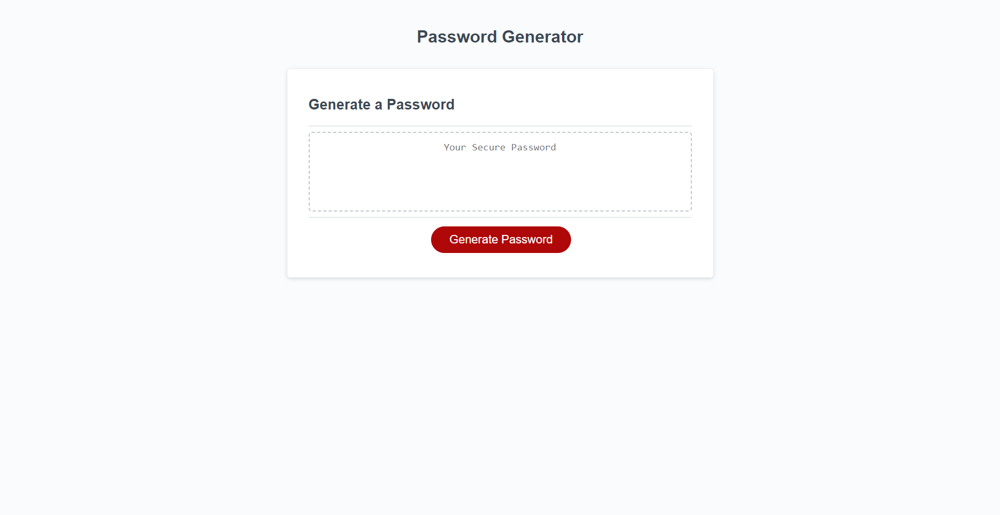

# Password-Gen
## Description
This project was completed as part of a homework assignment. This site is a secure password generator, by using the prompts on screen you will recieve a randomized password based on the prerequisites selected.

## Installation
Will need access to visual studio code or similar application, simply clone the repository(or the files within said repository) and launch from VS code

## Usage 
After launching the program all you need to do is click the prompt to generate a password then answer the questions prompted, after answering you will receive a password based on your response to the questions.

Link to deployed site: https://t0ny-macaroni.github.io/Password-Gen/

## License 

N/A
